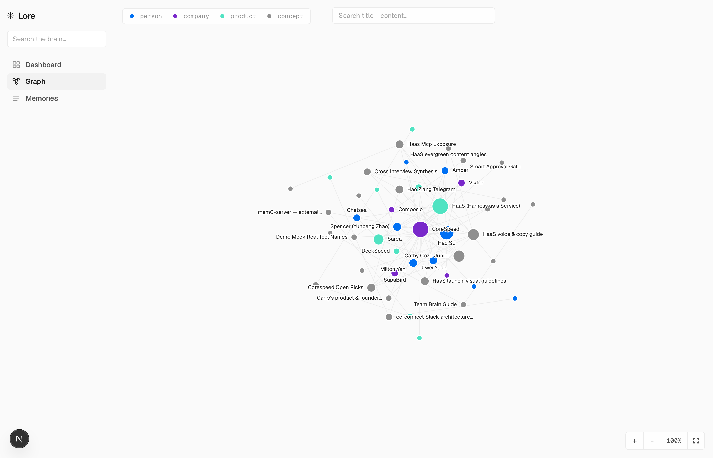
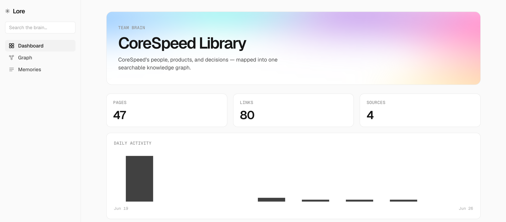

<h1 align="center">
  <br>
  Lore
</h1>

<p align="center">
  <strong>Browse your knowledge graph in the browser.</strong><br/>
  Lore is the read-only <strong>frontend</strong> for a <strong>gbrain</strong> knowledge brain — force-directed graph, dashboard, and full-text search. Bring your own <a href="https://github.com/garrytan/gbrain">gbrain</a> backend.
</p>

<p align="center">
  <a href="https://github.com/corespeed-io/lore/actions/workflows/ci.yml"></a>
  <a href="LICENSE"></a>
  
  
</p>

<p align="center">
  <a href="#quickstart">Quickstart</a> &nbsp;·&nbsp;
  <a href="#deploy-your-own">Deploy</a> &nbsp;·&nbsp;
  <a href="#configuration">Configure</a> &nbsp;·&nbsp;
  <a href=".github/CONTRIBUTING.md">Contribute</a>
</p>

<p align="center">
  
</p>

## What is Lore?

Lore is a **read-only** web UI for exploring a **[gbrain](https://github.com/garrytan/gbrain)** knowledge brain — your team's people, products, docs, and the decisions that connect them. It reads gbrain over MCP and renders a force-directed graph, a dashboard, and hybrid full-text search, so you can *see* and walk your knowledge instead of grepping it. It never writes.

## Features

- **Force-directed graph** — d3 node-link view with smooth zoom/pan, click-to-filter by type, and connection-walking from any node.
- **Dashboard** — pages, links, sources, daily activity, top hubs, and recent memories at a glance.
- **Hybrid search** — title + content search over your gbrain, as you type.
- **Pluggable viz modules** — drop in a new `src/lib/viz/<name>.ts` to add a visualization.
- **Fail-closed auth** — none (dev), HTTP Basic, or Cloudflare Access (JWT-verified). Read-only by design.
- **Deploy anywhere** — standalone Docker image; one-click to Vercel or Railway.

<p align="center">
  
</p>

## Quickstart

> **Prerequisite:** a running [gbrain](https://github.com/garrytan/gbrain) backend — point `GBRAIN_MCP_URL` at its MCP endpoint.

```bash
git clone https://github.com/corespeed-io/lore.git && cd lore
cp .env.example .env        # set GBRAIN_MCP_URL + GBRAIN_TOKEN — auth is off for local dev by default
npm install && npm run dev  # → http://localhost:3000
```

## Deploy your own

[](https://vercel.com/new/clone?repository-url=https://github.com/corespeed-io/lore&env=GBRAIN_MCP_URL,GBRAIN_TOKEN,AUTH_MODE,ALLOW_INSECURE&envDescription=Point%20at%20your%20gbrain%2C%20then%20choose%20an%20auth%20mode&envLink=https://github.com/corespeed-io/lore/blob/main/.env.example)

> **Lore [fails closed](#configuration).** A fresh deploy returns `403` until you set `AUTH_MODE` — `proxy` (Cloudflare Access) or `password`, or `none` **with** `ALLOW_INSECURE=1`. It will not serve a private brain by accident.

Lore is a standard Next.js standalone app, so it also runs on **Railway** (Dockerfile auto-detected) or any container host:

```bash
docker build -t lore . && docker run -p 3000:8080 --env-file .env lore
```

## Configuration

Config is entirely environment-driven — see [`.env.example`](.env.example) for the full list.

| Variable | Required | Notes |
|---|---|---|
| `GBRAIN_MCP_URL` | yes | Your gbrain MCP server endpoint |
| `GBRAIN_TOKEN` | \* | Static bearer (server-only, never sent to the browser) |
| `GBRAIN_CLIENT_ID` / `GBRAIN_CLIENT_SECRET` | \* | **Preferred**: a read-only OAuth client — Lore mints short-lived tokens |
| `APP_TITLE` / `APP_SUBTITLE` | no | Hero branding, per deployment |
| `AUTH_MODE` | no | `none` · `password` · `proxy` (Cloudflare Access). Defaults to `none` |
| `ALLOW_INSECURE` | no | Required to actually run with `AUTH_MODE=none` (auth fails closed otherwise) |
| `ACCESS_TEAM_DOMAIN` / `ACCESS_AUD` | for proxy | Cloudflare Access team domain + audience |

\* Provide **either** `GBRAIN_TOKEN` **or** a client id/secret. A **read-only** client is recommended so a leaked credential can't write.

**Auth fails closed.** `none` is honored only when `ALLOW_INSECURE=1` is also set; `proxy` verifies the Cloudflare Access JWT (signature, audience, issuer, expiry) and denies if it's misconfigured. Never expose the origin with `AUTH_MODE=none` to the internet.

## Extending — add a visualization module

```typescript
// src/lib/viz/<name>.ts
export function mount<Name>(element: HTMLElement, data: GraphData, options: VizOptions): void {
  // render with d3, canvas, or the DOM
}
```

Mount it from `src/components/GraphView.tsx` and add a test in `tests/`.

## Development

```bash
npm run dev        # dev server (hot reload)
npm run typecheck  # tsc --noEmit
npm run lint       # biome
npm test           # vitest
npm run build      # production build
```

Working with an AI coding agent? **[`AGENTS.md`](AGENTS.md)** is the single source of truth — Claude Code, Codex, Cursor, Gemini, and Copilot all read it.

## Contributing

Issues, ideas, and PRs are welcome — start with [CONTRIBUTING.md](.github/CONTRIBUTING.md) or open a [discussion](https://github.com/corespeed-io/lore/discussions). Built and maintained by [CoreSpeed](https://github.com/corespeed-io).

## License

[MIT](LICENSE) © CoreSpeed
