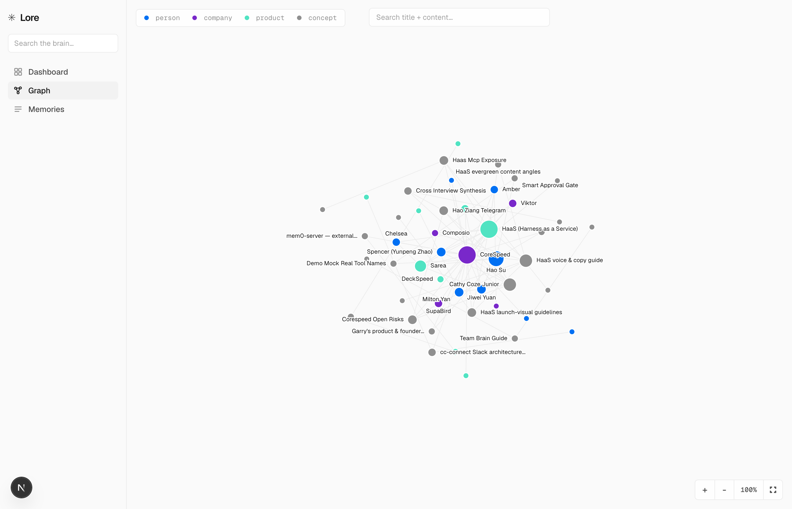
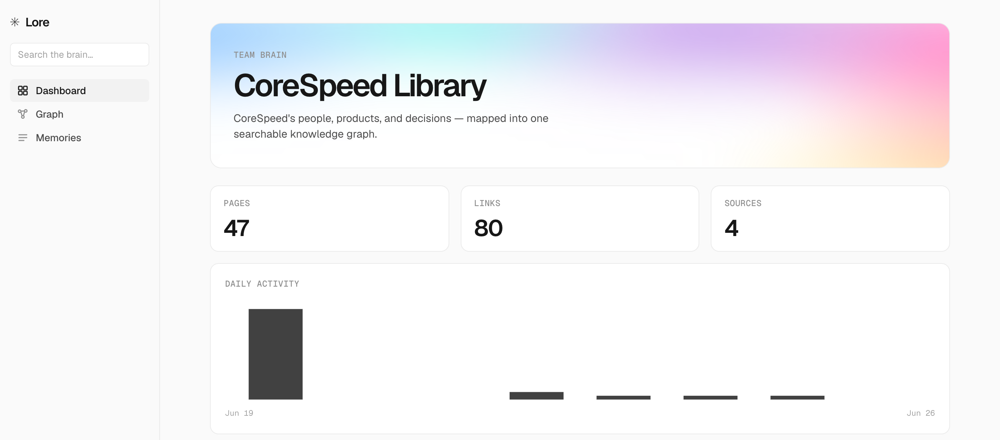

<h1 align="center">
  <br>
  Lore
</h1>

<p align="center">
  <strong>Browse your knowledge graph in the browser.</strong><br/>
  A knowledge-graph console and brain — force-directed graph, dashboard, hybrid search, and durable agent memory, on your own Postgres.
</p>

<p align="center">
  <a href="https://github.com/corespeed-io/lore/actions/workflows/ci.yml"></a>
  <a href="LICENSE"></a>
  
  
</p>

<p align="center">
  <a href="#quickstart">Quickstart</a> &nbsp;·&nbsp;
  <a href="#deploy-your-own">Deploy</a> &nbsp;·&nbsp;
  <a href="#configuration">Configure</a> &nbsp;·&nbsp;
  <a href=".github/CONTRIBUTING.md">Contribute</a>
</p>

<p align="center">
  
</p>

## What is Lore?

Lore is a web console for a personal knowledge graph — your notes, people, projects, and the links that connect them — rendered as a force-directed graph, a dashboard, and hybrid search, so you can *see* and walk your knowledge instead of grepping it.

It serves its own brain out of Postgres + pgvector — no other backend to run. The browser console holds only the reading credential: every write (vault import, `put_page`, `remember`) needs an explicit bearer token and never rides your viewer session.

## Features

- **Force-directed graph** — d3 node-link view with smooth zoom/pan, click-to-filter by type, and connection-walking from any node.
- **Dashboard** — pages, links, sources, daily activity, top hubs, and recent memories at a glance.
- **Hybrid search** — vector + keyword + trigram, rank-fused, as you type.
- **Bring your Obsidian vault** — pick a folder at `/import`; files become pages, folders become slug prefixes, and `[[wikilinks]]` become edges (including the ones in frontmatter, Markdown-style links, and aliases). Export the whole brain back out as a tar of `slug.md` from `/api/export`.
- **Agent memory** — an immutable event log, versioned thread summaries, and typed durable memories with provenance, supersession and historical (`as_of`) recall. Agents use `remember` / `recall` / `forget` / `inspect_memory`; memories are projected into the same graph and search as everything else, and a correction supersedes rather than overwrites.
- **Graph health** — the dashboard names the two reasons a graph looks empty: links pointing at pages that don't exist, and pages nothing points at.
- **Pluggable viz modules** — drop in a new `src/lib/viz/<name>.ts` to add a visualization.
- **Fail-closed auth** — none (dev), HTTP Basic, or a trusted gateway (JWT- or secret-verified; never a bare identity header). The console holds only the reading credential; writes need their own `BRAIN_WRITE_TOKEN`.
- **Deploy anywhere** — standalone Docker image; one-click to Vercel or Railway.

<p align="center">
  
</p>

## Quickstart

Bring only a Postgres with `pgvector` and `pg_trgm` (e.g. a free [Neon](https://neon.tech) database). PostgreSQL **12 or newer**; tested on 17 and 18. Lore serves its own brain: hybrid search (vector + keyword + trigram), a wikilink graph, and an MCP endpoint at `POST /api/mcp` your agents can write memories to (`put_page` / `remember_note` / `delete_page` for pages, `remember` for agent memory; bearer `BRAIN_WRITE_TOKEN`).

```bash
git clone https://github.com/corespeed-io/lore.git && cd lore
cp .env.example .env        # set DATABASE_URL + EMBEDDINGS_*
npm install && npm run dev  # → http://localhost:3000
```

### Wire it to your agent

Lore exposes MCP at `POST /api/mcp` — spec revision **2026-07-28**, with the 2025 handshake revisions still served for older clients. Point any MCP client at it with the write bearer:

```bash
claude mcp add --transport http lore http://localhost:3000/api/mcp --header "Authorization: Bearer $BRAIN_WRITE_TOKEN"
```

### From the terminal

`bin/lore.mjs` is a zero-dependency CLI over the same endpoint — it reads `.env` from the working directory, so a checkout needs no configuration:

```bash
./bin/lore.mjs search "what did we decide about auth"
./bin/lore.mjs put notes/standup --title "Standup" < notes.md
./bin/lore.mjs health          # orphans + broken links
./bin/lore.mjs sweep --dry     # what mention-linking would connect
```

`lore` with no arguments lists every command. Point it elsewhere with `LORE_URL` / `LORE_TOKEN`.

### Skills, for whichever agent you use

Lore ships three [SKILL.md](https://agentskills.io) files — an open standard read by 70+ agents, and the same file works in all of them.

```bash
npx skills add corespeed-io/lore
```

That installs them into whichever agent you use — [vercel-labs/skills](https://github.com/vercel-labs/skills) reads `skills/` straight out of this repo, so there is no npm package and no clone. From a checkout, `npx skills add .` does the same thing.

- **lore-brain** — which write door (`put_page` / `remember_note` / `remember`) and which read door (`search` / `recall` / the graph)
- **lore-memory** — scopes, supersession, `as_of` recall, the event log
- **lore-curate** — orphans, broken links, renames, the background jobs

## Deploy your own

[](https://vercel.com/new/clone?repository-url=https://github.com/corespeed-io/lore&env=DATABASE_URL,EMBEDDINGS_URL,EMBEDDINGS_API_KEY,EMBEDDINGS_MODEL,EMBEDDINGS_DIM,BRAIN_WRITE_TOKEN,AUTH_MODE&envDescription=Point%20at%20your%20Postgres%2C%20then%20choose%20an%20auth%20mode&envLink=https://github.com/corespeed-io/lore/blob/main/.env.example)

> **Lore [fails closed](#configuration).** A fresh deploy returns `403` until you set `AUTH_MODE` — `gateway` or `password`, or `none` **with** `ALLOW_INSECURE=1`. It will not serve a private brain by accident.

Lore is a standard Next.js standalone app, so it also runs on **Railway** (Dockerfile auto-detected) or any container host:

```bash
docker build -t lore . && docker run -p 3000:8080 --env-file .env lore
```

Or on **Cloudflare Workers** (via OpenNext) — put any Postgres behind a [Hyperdrive](https://developers.cloudflare.com/hyperdrive/) binding (free plan included; see `wrangler.jsonc`):

```bash
npx wrangler hyperdrive create lore-db --caching-disabled --connection-string="postgres://…"
npx wrangler secret put EMBEDDINGS_API_KEY   # + BRAIN_WRITE_TOKEN, UI_PASSWORD…
npm run cf:deploy
```

## Configuration

Config is entirely environment-driven — see [`.env.example`](.env.example) for the full list.

| Variable | Required | Notes |
|---|---|---|
| `DATABASE_URL` | yes | Postgres 12+ with `vector` + `pg_trgm` |
| `EMBEDDINGS_URL` / `_API_KEY` / `_MODEL` / `_DIM` | yes | Any OpenAI-compatible endpoint, including a local ollama |
| `EMBEDDINGS_QUERY_PREFIX` | no | Prepended to queries only — the instruction the 2026 models want |
| `BRAIN_WRITE_TOKEN` / `BRAIN_READ_TOKEN` | yes | Agents' bearer for the MCP endpoint; ≥16 chars or refused |
| `APP_TITLE` / `APP_SUBTITLE` | no | Hero branding, per deployment |
| `AUTH_MODE` | no | `none` · `password` · `gateway`. Defaults to `none` |
| `ALLOW_INSECURE` | no | Required to actually run with `AUTH_MODE=none` (auth fails closed otherwise) |
| `AUTH_GATEWAY_JWKS_URL` / `_ISSUER` / `_AUDIENCE` | for gateway | Verify a JWT the gateway signed — Cloudflare Access sends one already |
| `AUTH_GATEWAY_SHARED_SECRET` | for gateway | Or a secret header, if your proxy can't sign a JWT |
| `AUTH_GATEWAY_USER_HEADER` | no | Where identity arrives (default `X-Forwarded-User`), read only after a proof holds |

**Auth fails closed, and a half-configured mode is an error rather than an opening** — `AUTH_MODE=password` with no `UI_PASSWORD` is refused, not downgraded. `gateway` never trusts an identity header on its own: it reads `X-Forwarded-User` only after verifying a JWT or a shared secret, and refuses every request if neither is configured. Never expose the origin with `ALLOW_INSECURE=1` to the internet.

## Extending — add a visualization module

```typescript
// src/lib/viz/<name>.ts
export function mountName(el: HTMLElement, data: GraphData, opts: Opts): Instance {
  // render with d3, canvas, or the DOM; return { destroy, ... } for teardown
}
```

Mount it from `src/components/GraphView.tsx` and add a test in `tests/`.

## Development

```bash
npm run dev        # dev server (hot reload)
npm run typecheck  # tsc --noEmit
npm run lint       # biome
npm test           # vitest
npm run build      # production build
```

Working with an AI coding agent? **[`AGENTS.md`](AGENTS.md)** is the single source of truth — Claude Code, Codex, Cursor, Gemini, and Copilot all read it.

## Contributing

Issues, ideas, and PRs are welcome — start with [CONTRIBUTING.md](.github/CONTRIBUTING.md) or open a [discussion](https://github.com/corespeed-io/lore/discussions). Built and maintained by [CoreSpeed](https://github.com/corespeed-io).

## License

[MIT](LICENSE) © CoreSpeed
