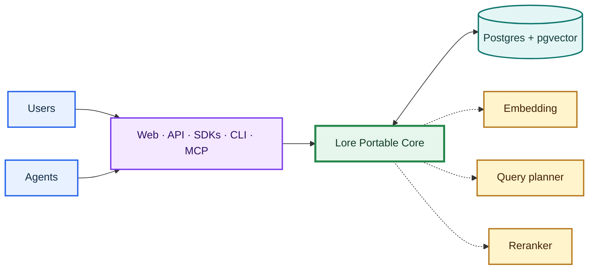

<h1 align="center">
  <br>
  Lore
</h1>

<p align="center">
  <strong>Open-source memory infrastructure for users and their agents.</strong><br>
  Store, retrieve, and evaluate user-owned memory on your own Postgres.
</p>

<p align="center">
  <a href="https://github.com/corespeed-io/lore/actions/workflows/ci.yml"></a>
  <a href="LICENSE"></a>
  
  
</p>

Lore owns memory storage, authorization, retrieval, and evaluation. Workspaces are
the tenant boundary; private Memory belongs to a User, not to a single Agent.
Postgres row-level security enforces that boundary before search ranking or graph
assembly.

## Architecture

The same Portable Core and Postgres schema run in OSS self-hosting and CoreSpeed
Cloud. Model integrations are optional; Postgres remains the canonical store.


```mermaid
flowchart LR
    Users["Users"] --> Interfaces["Web · API · SDKs · CLI · MCP"]
    Agents["Agents"] --> Interfaces
    Interfaces --> Core["Lore Portable Core"]
    Core <--> Database[("Postgres + pgvector")]
    Core -.-> Embed["Embedding"]
    Core -.-> Plan["Query planner"]
    Core -.-> Rerank["Reranker"]

    classDef actor fill:#e8f1ff,stroke:#2563eb,color:#102a43,stroke-width:2px
    classDef interface fill:#f3e8ff,stroke:#7c3aed,color:#2e1065,stroke-width:2px
    classDef core fill:#e6f6ec,stroke:#24864b,color:#123b24,stroke-width:3px
    classDef data fill:#e3f6f5,stroke:#0f766e,color:#123b3a,stroke-width:2px
    classDef model fill:#fff4cc,stroke:#b7791f,color:#422006,stroke-width:2px
    class Users,Agents actor
    class Interfaces interface
    class Core core
    class Database data
    class Embed,Plan,Rerank model
```

## Quick start

Requires Docker with Compose. The local stack includes Postgres with pgvector,
applies migrations, creates restricted runtime roles, and starts Lore plus its
maintenance worker.

```bash
git clone https://github.com/corespeed-io/lore.git
cd lore
cp .env.example .env  # replace the example passwords
docker compose up --build
```

Open [http://localhost:3000](http://localhost:3000).

Lexical retrieval works without a model server. For local semantic retrieval,
install Ollama and pull the default 1024-dimensional embedding model:

```bash
ollama pull qwen3-embedding:0.6b
```

The example configuration is intentionally local-only. Never expose
`AUTH_MODE=none` or `ALLOW_INSECURE=1` to the internet.

## What Lore gives you

- **User-owned Memory** — shared and user-private scopes, provenance, optimistic
  concurrency, replay-safe writes, and complete create/read/update/delete.
- **Guarded learning** — immutable Observations stay outside canonical retrieval;
  owner-private Memory Proposals require explicit human acceptance.
- **Retrieval without authorization leaks** — lexical and optional vector search
  apply Workspace, ownership, scope, Membership, Agent grant, and RLS filters before
  top-k.
- **A navigable memory graph** — durable Memory Links, visible-node-safe edges,
  derived affinity, and clickable `[[reference]]` wikilinks.
- **Agent-ready interfaces** — versioned HTTP APIs, generated TypeScript and Python
  contracts, SDKs, a CLI, and an external MCP adapter.
- **Measurable production operation** — background embedding jobs, portable
  Workspace archives, health probes, and Evaluation Suites for quality, isolation,
  latency, and cost.

AutoDream, automatic consolidation, summarization, and proactive insight generation
are intentionally outside v1.

## API and operations

Stable integrations use `/api/v1`; the OpenAPI 3.1 document is available at
`/openapi.json`. Human requests select a Workspace with `x-lore-workspace-id`;
Agents also present a `lore_agent_…` bearer credential.

The OSS profile runs on Node, Docker, and Postgres. CoreSpeed Cloud uses the same
domain modules and schema on Cloudflare Workers with cache-disabled Hyperdrive.
See the documentation before deploying beyond localhost:

- [Technical reference](docs/reference.md) — embedding, reranking, planning, APIs,
  SDKs, Cloudflare, development, and benchmarks
- [Operations and portability](docs/operations.md) — backup and restore, Workspace
  archives, embedding rollouts, health probes, and telemetry
- [Product vocabulary](CONTEXT.md) — the canonical domain model and invariants
- [Contributing guide](.github/CONTRIBUTING.md) — local setup and contribution flow

## Development

Full source verification requires Bun 1.3.14+, Node 24 LTS, and Python 3.12+.

```bash
bun install --frozen-lockfile
bun run typecheck
bun run lint
bun run test
```

Working with a coding agent? [`AGENTS.md`](AGENTS.md) is the single source of truth
for repository architecture and security constraints.

## License

[MIT](LICENSE) © CoreSpeed
