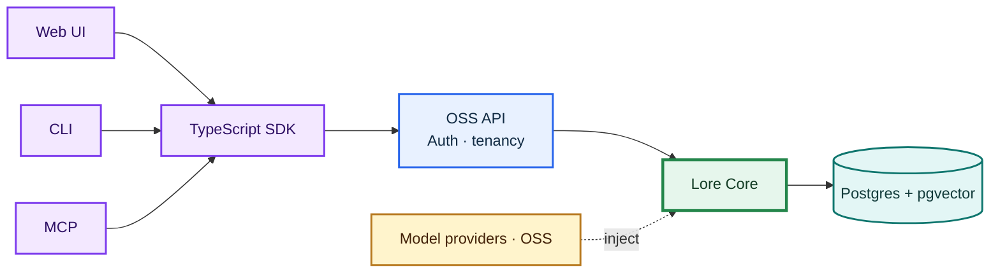

<h1 align="center">
  <br>
  Lore
</h1>

<p align="center">
  <strong>Open-source memory infrastructure for users and their agents.</strong><br>
  Store, retrieve, and evaluate user-owned memory on your own Postgres.
</p>

<p align="center">
  <a href="https://github.com/corespeed-io/lore/actions/workflows/ci.yml"></a>
  <a href="LICENSE"></a>
  
  
</p>

Lore owns memory storage, authorization, retrieval, and evaluation. Workspaces are
the tenant boundary; private Memory belongs to a User, not to a single Agent.
Postgres row-level security enforces that boundary before search ranking or graph
assembly. Lore can also index exact Git revisions, so an agent can ground an answer
in both what the team decided and what the code says at one commit.

## Architecture

Lore Core ([`packages/lore-core`](packages/lore-core/README.md)) is the memory
engine: storage, chunking, retrieval, Memory Links, and embedding maintenance. It
owns its SQL, but it imports no database driver and opens no connection. Lore OSS,
the rest of this repository, owns the driver and the connections. It also supplies
identity, Workspaces, authorization, request replay, the HTTP API, clients, the web
UI, code indexing, deployment, and concrete model adapters. It gives the engine
transactions that already enforce access policy. The same
application and Postgres schema run in OSS self-hosting and CoreSpeed Cloud. Model
integrations are optional; Postgres remains the canonical store.

See [the architecture guide](docs/architecture.md) for domain modules, runtime seams,
and the organization of scripts and tests.


```mermaid
flowchart LR
    UI["Web UI"] --> SDK["TypeScript SDK"]
    CLI["CLI"] --> SDK
    MCP["MCP"] --> SDK
    SDK --> API["OSS API<br/>Auth · tenancy"]
    API --> Core["Lore Core"]
    Core --> Database[("Postgres + pgvector")]
    Providers["Model providers · OSS"] -. inject .-> Core

    classDef interface fill:#f3e8ff,stroke:#7c3aed,color:#2e1065,stroke-width:2px
    classDef api fill:#e8f1ff,stroke:#2563eb,color:#102a43,stroke-width:2px
    classDef core fill:#e6f6ec,stroke:#24864b,color:#123b24,stroke-width:3px
    classDef data fill:#e3f6f5,stroke:#0f766e,color:#123b3a,stroke-width:2px
    classDef model fill:#fff4cc,stroke:#b7791f,color:#422006,stroke-width:2px
    class UI,CLI,MCP,SDK interface
    class API api
    class Core core
    class Database data
    class Providers model
```

## Quick start

Requires Docker with Compose. The local stack includes Postgres with pgvector,
applies migrations, creates restricted runtime roles, and starts Lore plus its
maintenance worker.

```bash
git clone https://github.com/corespeed-io/lore.git
cd lore
cp .env.example .env  # replace the example passwords (URL-safe: openssl rand -hex 32)
docker compose up --build
```

Open [http://localhost:3000](http://localhost:3000).

Lexical retrieval works without a model server. For local semantic retrieval,
install Ollama and pull the default 1024-dimensional embedding model:

```bash
ollama pull qwen3-embedding:0.6b
```

Ollama, Google Gemini, OpenAI, and Vercel AI Gateway embeddings are supported;
choose one per deployment in `.env`. Reranking and query planning are optional. See
the [technical reference](docs/reference.md) for every provider setting.

The example configuration is intentionally local-only. Never expose
`AUTH_MODE=none` or `ALLOW_INSECURE=1` to the internet. Apple Silicon users can
also run the frontend, worker, Ollama, and a local Postgres installation through
the [native one-command service](docs/reference.md#native-one-command-service-on-apple-silicon).

### Connect an agent

1. Open `/agents` in the Workspace the Agent should use. Create an Agent with
   read or write permission, choose **Issue credential**, and copy the
   `lore_agent_…` token. Lore shows it once.
2. Build the clients with `bun install --frozen-lockfile && bun run build:packages`.
3. Run the MCP adapter from your MCP host with the Agent's environment:

```bash
LORE_URL=http://127.0.0.1:3000 \
LORE_WORKSPACE_ID=<workspace-uuid> \
LORE_AGENT_TOKEN=lore_agent_... \
bun --no-env-file packages/mcp/dist/bin.js
```

The Workspace is process configuration, not tool input, so a model cannot cross
it. The [developer integration guide](docs/developer-integration.md) covers the
TypeScript SDK, the CLI, and the full MCP tool list.

## What Lore gives you

- **User-owned Memory** — shared and user-private scopes, provenance, optimistic
  concurrency, replay-safe writes, and complete create/read/update/delete.
- **Guarded learning** — immutable Observations stay outside canonical retrieval;
  owner-private Memory Proposals require explicit human acceptance.
- **Retrieval without authorization leaks** — hybrid search fuses English and
  simple full-text search, a CJK substring channel, and optional vector search. Every
  channel applies Workspace, ownership, scope, Membership, Agent grant, and RLS
  filters before top-k. Optional reranking sees only authorized evidence, and
  optional query planning sees only the question.
- **Code-aware memory** — index an operator-configured Git repository at an exact
  commit into AST-aware Code Artifacts, search that revision, and read bounded
  callers and callees. Memories can cite code, and Lore reports each citation as
  current, moved, changed, deleted, ambiguous, or unverifiable.
- **One grounded context packet** — `POST /api/v1/context/retrieve` returns Memory,
  exact-revision Code, citation state, conflicts, and a receipt in one request.
- **A navigable memory graph** — durable Memory Links written from the SDK, CLI, and MCP,
  visible-node-safe edges, derived affinity, and clickable `[[reference]]` wikilinks.
- **Agent-ready interfaces** — versioned HTTP APIs, a TypeScript SDK with generated
  contracts, a CLI, and an external MCP adapter.
- **Measurable production operation** — background embedding jobs, model rollouts
  that build new vectors beside the serving ones, portable Workspace archives,
  health probes, and Evaluation Suites for quality, isolation, latency, and cost. Benchmark runners cover LongMemEval,
  LoCoMo, and MemoryAgentBench ([evaluation tools](tools/evaluation/README.md)).

AutoDream, automatic consolidation, summarization, and proactive insight generation
are intentionally outside v1.

## API and operations

Stable integrations use `/api/v1`; the OpenAPI 3.1 document is available at
`/openapi.json`. Human requests select a Workspace with `x-lore-workspace-id`;
Agents also present a `lore_agent_…` bearer credential.

The OSS profile runs Next.js with Hono APIs, maintenance, and database tooling on
Bun, with Docker and Postgres support.
CoreSpeed Cloud uses the same
domain modules and schema on Cloudflare Workers with cache-disabled Hyperdrive.
See the documentation before deploying beyond localhost:

- [Documentation index](docs/README.md) — current guides, architecture decisions, and research
- [Developer integration](docs/developer-integration.md) — API, SDK, CLI, MCP, and host retrieval setup
- [Technical reference](docs/reference.md) — embedding, reranking, planning, APIs,
  SDK, Cloudflare, development, and benchmarks
- [Operations and portability](docs/operations.md) — backup and restore, Workspace
  archives, embedding rollouts, health probes, and telemetry
- [Product vocabulary](docs/CONTEXT.md) — the canonical domain model and invariants
- [Contributing guide](.github/CONTRIBUTING.md) — local setup and contribution flow

## Development

Full source verification requires Bun 1.4.2+.

```bash
bun install --frozen-lockfile
bun run design:check
bun run typecheck
bun run lint
bun run architecture:check
bun run test
bun run build
bun run packages:smoke
```

All of these and the [deployment dry runs](docs/reference.md#verify-changes) must
pass before you open a pull request.

Working with a coding agent? [`AGENTS.md`](AGENTS.md) is the single source of truth
for repository architecture and security constraints.

## License

[MIT](LICENSE) © CoreSpeed
