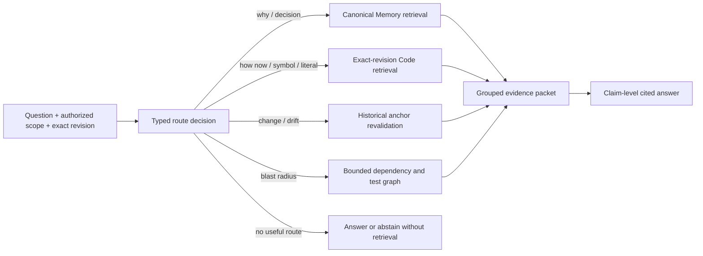

# Joint Memory + Code evidence: research audit

Audited: 2026-08-14

Scope: Lore's proposed north-star architecture:

- canonical natural-language Memory stores reviewed understanding, decisions,
  constraints, and rationale;
- Code Index stores rebuildable facts derived from one exact repository revision;
- immutable typed anchors connect a Memory to historical code evidence;
- query-time orchestration selects Memory, current code, history, and bounded graph
  evidence, revalidates anchors, and produces evidence-backed answers.

Sources are original papers, official conference records, official product
documentation, and official source repositories. This note evaluates the design;
it does not modify Lore's implementation.

## Verdict

This is a credible north-star and is strongly convergent with the best recent
evidence. The closest controlled result is the ICLR 2026 paper
[Improving Code Localization with Repository Memory](https://openreview.net/pdf?id=8yjWLJy2eX).
It combines historical repository memory with an exact-current-repository code
graph and improves LocAgent file localization on both SWE-bench Verified and
SWE-bench Live. The paper's successful workflow is also structurally close to
Lore's proposal: use memory to form a high-level hypothesis, then inspect current
code and its relationships to verify it.

The research does **not** validate a naive implementation. It contradicts five
tempting simplifications:

1. retrieval should not always be on;
2. Memory and Code should not be collapsed into one semantic store or one raw
   score;
3. a reviewed Memory is an accountable claim, not automatically current truth;
4. a locally unchanged code anchor does not prove that its surrounding behavior is
   unchanged;
5. good retrieval metrics do not by themselves establish correct, cited answers or
   correct patches.

The best research-consistent formulation is therefore:

> **typed, selective, staged evidence orchestration** over independently
> authorized stores, with exact revision binding, explicit provenance and
> freshness, and a neutral path that retrieves neither source when it is not
> useful.

No located paper evaluates Lore's complete loop—human-reviewed canonical Memory,
immutable Memory-to-Code anchors, exact-revision revalidation, multi-tenant
authorization, and end-task answers—end to end. The design is
**best-practice-convergent, not yet a proven universal optimum**.

## What the strongest direct evidence says

### Repository Memory + current code graph works, but only conditionally

[RepoMem](https://arxiv.org/html/2510.01003) builds two repository-specific
memory stores from history:

- episodic entries retain commit SHA, message, timestamp, modified files, patch,
  and linked issue;
- semantic entries are LLM-generated functionality summaries for the 200 most
  frequently edited files.

The agent can then use these stores alongside LocAgent's current repository graph,
whose tools search entities, traverse `contain`/`invoke`/`import`/`inherit` edges,
and retrieve exact code entities. This separation matters: the system does not
turn history, summaries, and source code into one undifferentiated vector index.

On SWE-bench Verified, file Acc@5 rises from `71.6` for LocAgent to `74.3` with
episodic memory, `72.8` with semantic memory, and `76.5` with both. On SWE-bench
Live, the corresponding result rises from `63.1` to `64.6`, `63.9`, and `66.2`.
The combined result supports complementary history, semantics, and structural code
routes rather than choosing one universal representation.

The negative result is equally important. For repositories with fewer or less
relevant historical commits, Acc@5 falls from `67.4` to `54.3`. The authors find
that irrelevant memories pollute the reasoning context and explicitly recommend a
policy that learns when to ignore memory and return to first-principles code
exploration. Cost is instance-dependent as well: examples where LocAgent fails rise
from roughly `$0.54-$0.59` to `$0.87-$0.89` on average, although useful memories
make some individual examples cheaper. Averages hide both effects.

The retrieval ablation also rejects a dense-only default. On Django, GritLM-7B
dense retrieval obtains `73.6` Acc@5, whitespace BM25 `77.9`, and BM25 with a
code-aware tokenizer `79.7`. The authors attribute this to code's rigid entity
vocabulary: similar-looking identifiers can have different functions.

There is no released RepoMem implementation at audit time. The paper says source
will be published, but a GitHub search located no author repository. The controlled
paper result is high-quality; reproducibility is currently incomplete.

### Selective retrieval is a correctness requirement, not just an optimization

[Repoformer (ICML 2024)](https://proceedings.mlr.press/v235/wu24a.html) directly
studies whether repository retrieval should run on every completion. Its analysis
finds retrieved cross-file context improves only a minority of cases, leaves most
unchanged, and harms a material minority. Its selective policy provides up to 70%
online inference speedup without reducing quality. The official implementation is
available at pinned commit
[`5b05713`](https://github.com/amazon-science/Repoformer/tree/5b0571318e9918fd2af132c4b35077f9ea331133).

For Lore, the minimum routing contract should therefore admit four results:
`memory-only`, `code-only`, `both`, and `abstain/no-retrieval`. The production
fallback must remain at least as good as today's independent Memory search and Code
search; the joint path cannot become mandatory context inflation.

### Multi-channel code retrieval helps, but channels are not monotonically useful

[CodeRAG (EMNLP 2025)](https://aclanthology.org/2025.emnlp-main.1187/) combines
sparse, dense, and data-flow routes, then aligns a reranker with the generator. On
its reported ReccEval setting, the combined system substantially beats each single
channel, but one ablation becomes worse after adding the dense route until reranking
is applied. The official code is available at pinned commit
[`f50251c`](https://github.com/KDEGroup/CodeRAG/tree/f50251c86839bc50dbf8b928ae4f3eeacd75e4c5).

[DraCo (ACL 2024)](https://aclanthology.org/2024.acl-long.431/) and
[RepoGraph (ICLR 2025)](https://arxiv.org/abs/2410.14684) independently support
bounded dependency/structure routes. RepoGraph reports an average relative
success-rate improvement of `32.8%` when its line-level repository graph is added
to four localization/repair methods, while its own error analysis still includes
wrong localization, contextual misalignment, and regressive fixes. Its released
implementation also warns that graph construction can be slow and ships cached
graphs for its benchmark; see pinned commit
[`6c3977d`](https://github.com/ozyyshr/RepoGraph/tree/6c3977d87845993bf2c0359b4ac752278d7f3c45).

The appropriate conclusion is not "add every route." It is independently bounded
recall channels, source-preserving rank fusion, an optional reranker, and mandatory
per-channel ablation.

### Retrieval success and answer success must be measured separately

[CodeRAG-Bench (Findings of NAACL 2025)](https://aclanthology.org/2025.findings-naacl.176/)
evaluates ten retrievers with ten code models. High-quality retrieved context often
helps, but the retriever with the best retrieval metric does not consistently
produce the best generated code. Generators also fail to use otherwise relevant
contexts because of context limits and integration failures. Its official
evaluation harness is available at pinned commit
[`f9e100c`](https://github.com/code-rag-bench/code-rag-bench/tree/f9e100ca9ed94b8f1983b356ae81966e30210cf4).

[ALCE (EMNLP 2023)](https://aclanthology.org/2023.emnlp-main.398/) reaches the same
lesson for cited question answering: a fluent, correct-looking answer can still
lack complete citation support. Lore must evaluate evidence retrieval, claim-level
entailment/citation completeness, and downstream task success as separate stages.

## Memory research: support and boundary

### Episodic and semantic routes are complementary

RepoMem provides the most domain-specific evidence. A broader corroboration comes
from [Mnemis (ACL 2026)](https://aclanthology.org/2026.acl-long.1096/): lexical and
dense episodic/entity retrieval scores `73.8`, a graph-only route `81.6`, their
combination `89.1`, and a complementary hierarchical route lifts the full result to
`93.3` on its reported LoCoMo setup. This supports preserving heterogeneous routes
until late orchestration. Its official repository at pinned commit
[`4552fed`](https://github.com/microsoft/Mnemis/tree/4552fed19bc0cde7b990a6ceb0365cd75b1b3453)
does not release the complete ingestion, System-1, reranking, and evaluation stack,
so the headline is not a directly reproducible Lore recipe.

[LongMemEval (ICLR 2025)](https://proceedings.iclr.cc/paper_files/paper/2025/file/d813d324dbf0598bbdc9c8e79740ed01-Paper-Conference.pdf)
finds that original evidence plus extracted facts/summaries outperforms either
representation alone. Summary-only retrieval loses answer-bearing detail. This
matches Lore's boundary: Memory can be a compact semantic/rationale entry point,
while Code Artifacts and Observations preserve original evidence.

### Automatic consolidation is useful research, but conflicts with Lore's trust model

[Generative Agents (UIST 2023)](https://research.google/pubs/generative-agents-interactive-simulacra-of-human-behavior/),
[Mem0](https://arxiv.org/abs/2504.19413), and
[A-MEM (NeurIPS 2025)](https://arxiv.org/abs/2502.12110) report benefits from
automatically extracting, linking, reflecting on, or rewriting memories. RepoMem's
automatically generated active-file summaries also have a measurable standalone
gain.

That evidence creates a real product tension: Lore's human-review boundary may
trade coverage and benchmark score for accountability. No located controlled study
shows that human-reviewed canonical Memory maximizes retrieval accuracy. Lore
should describe review as a governance and provenance choice, not as an empirically
proven quality optimum.

If automatic code summaries are later useful, keep them rebuildable and typed as
code-derived summaries, Observations, or owner-private Proposals. They should not
silently become canonical Memory. This preserves the empirical benefit as an
optional route without creating a self-reinforcing chain in which a generated
summary is later treated as reviewed fact.

[GitHub Copilot Memory](https://docs.github.com/en/enterprise-cloud@latest/copilot/concepts/agents/copilot-memory)
is the closest deployed precedent for Lore's governance design: repository memories
carry code citations, citations are checked against the current branch, and only
validated memories are used. Owners can review or delete them. However, this is
public-preview product documentation, not a controlled study. GitHub also expires
unused memories after 28 days, whereas Lore treats canonical Memory as durable.
[MemoryAgentBench (ICLR 2026)](https://openreview.net/forum?id=DT7JyQC3MR)
identifies selective forgetting and conflict resolution as a core memory competency,
so Lore must evaluate stale accumulation even if deletion remains human-controlled.

## Freshness and provenance: one missing distinction

Exact commit selection before ranking is strongly supported by
[LibEvolutionEval (NAACL 2025)](https://aclanthology.org/2025.naacl-long.348/):
version-specific documentation improves code completion, while model and retriever
bias toward the wrong library version remains. The requested commit OID, content
digest, and validation state should therefore be visible to the answer reader, not
only enforced inside SQL.

[FreshLLMs (Findings of ACL 2024)](https://aclanthology.org/2024.findings-acl.813/)
shows that models struggle with fast-changing facts and false premises and improve
when supplied with organized, current web evidence. This supports both freshness
metadata and explicit abstention when the user's premise is unsupported.

Lore's current local anchor states—`current`, `moved`, `changed`, `deleted`,
`ambiguous`, and `unverifiable`—are necessary, but not sufficient. A declaration
can retain the same digest while one of its callees, callers, configuration files,
generated artifacts, dependency versions, or runtime dispatch rules changes. The
anchor is locally current while the claim it supported is contextually stale.

Use two independent dimensions:

| Dimension | Proposed states | Meaning |
| --- | --- | --- |
| Local anchor | `current`, `moved`, `changed`, `deleted`, `ambiguous`, `unverifiable` | Can the immutable historical locator be resolved, and is its selected source locally identical? |
| Contextual impact | `unaffected`, `possibly_affected`, `affected`, `unknown` | Did bounded dependencies, configuration, tests, or runtime-relevant neighbors change in a way that may invalidate the Memory claim? |

The second state must remain conservative. Static graphs are evidence, not runtime
truth. The 2026 preprint
[TDAD](https://arxiv.org/abs/2603.17973) reports substantially fewer regressions
when a static dependency graph supplies targeted impact context, but its small
Python-only evaluation cannot cover reflection, monkey-patching, generated code,
configuration, or other dynamic behavior. "Unknown" is an honest result.

Memory itself should never be rewritten during revalidation. Preserve the original
claim and historical anchor, then attach the current state and any new selected
target. For a current-implementation question, current requested-revision code is
authoritative evidence about source text; for a why/rationale question, reviewed
Memory is authoritative evidence about the recorded decision. When the two disagree,
the answer should expose the disagreement rather than let a fused score choose a
winner.

## Lore status and the actual gaps

Lore has already implemented most of the storage and trust boundary. The remaining
work is mainly query orchestration and evaluation, not another persistence redesign.

| Capability | Current Lore status | Research-relevant gap |
| --- | --- | --- |
| Separate canonical Memory and rebuildable Code Index | Present: independent domains and public tool families | Keep separate; do not introduce a shared canonical row or universal embedding score |
| Exact revision and atomic generation | Present: full Git OID, tree/object ingestion, generation activation, rollback state | Make revision/freshness metadata visible in the eventual evidence packet and answer prompt |
| Typed immutable Memory-to-Code anchors | Present: anchors survive Artifact pruning and preserve historical locator/digest | Joint retrieval does not yet use anchors as a staged expansion and verification route |
| Local anchor revalidation | Present: `current`/`moved`/`changed`/`deleted`/`ambiguous`/`unverifiable` | No separate transitive/contextual impact state |
| Code lexical/symbol/path search | Present with per-channel bounds and rank-level fusion | No dense code channel; it should remain an evaluated variant, not a prerequisite |
| Dependency graph | Present as bounded exact-revision `calls`/`imports`/`references` reads with explicit resolution state | No query-time blast-radius policy joining anchors, dependencies, tests, and token budgets; static/dynamic coverage remains limited |
| Authorized independent retrieval | Present for Memory and Code families | No typed `memory-only`/`code-only`/`both`/`abstain` router or grouped cross-source evidence contract |
| Evidence-backed answering | Memory and Code can be read separately | No claim-level joint answer path that preserves source kind, commit, anchor relation, freshness, contradiction, and citation entailment |
| Evaluation | Memory and Code have independent benchmarks and adversarial tests | No temporal joint benchmark with gold Memory IDs, code spans, anchor states, contradictions, and end-task tests |

This means the highest-risk missing feature is not retrieval recall in isolation. It
is the policy that decides **when and how evidence crosses the Memory/Code boundary**.
That policy should be prototyped offline against a falsifiable corpus before becoming
a new MCP context tool or default agent behavior.

## Recommended query contract

The route decision is semantic, not merely a performance optimization:

| Intent | Default route | Evidence priority |
| --- | --- | --- |
| Why was this designed this way? | Memory, then its anchors and current revalidation | Reviewed rationale; current code may confirm or contradict implementation |
| How does it work now? | Current Code, then only validated related Memory | Requested-revision source and dependencies |
| What changed or became stale? | Historical anchor + current revision + diff | Preserve both historical and current evidence |
| What is the blast radius? | Current Code + bounded dependency/test graph | Structural evidence with explicit ambiguity/unknown states |
| Find this symbol/path/literal | Code only | Exact and lexical code channels; no Memory tax |
| Recall a preference or decision with no code claim | Memory only | Canonical Memory provenance |

Every route must apply Actor/RLS, Workspace, repository, scope, and exact-revision
filters **before** top-k. Fuse ranks only after source-local retrieval; preserve
`sourceKind`, Memory ID or Artifact identity, commit OID, digest, anchor relation,
freshness states, and authorization boundary in the returned evidence packet.
Graph expansion must be bounded by hop count, fan-out, candidate count, and token
budget. Never expose a hidden node's existence or degree through an otherwise
visible Memory or Artifact.

## Adversarial failures the design must survive

1. **Stale reviewed narrative:** an old, approved Memory conflicts with the
   requested revision; the answer must not present it as current implementation.
2. **Transitive staleness:** the anchored declaration is byte-identical while a
   dependency, caller, config, generated file, or test contract changed.
3. **Static/runtime gap:** source and static edges miss reflection, dynamic dispatch,
   environment flags, generated code, or dependency runtime behavior.
4. **Memory distraction:** sparse or irrelevant history lowers quality below the
   code-only baseline, as in RepoMem's `-13.1` point repository group.
5. **Channel poisoning:** a dense near-neighbor outranks an exact but lexically
   rigid code entity; exact, symbol, path, graph, and dense channels need separate
   budgets and ablations.
6. **Summary substitution:** an automatic summary omits the answer-bearing detail
   or hallucinates a relationship, then recursively becomes retrieval evidence.
7. **Branch/revision confusion:** a high-scoring Artifact from another commit,
   generation, or repository appears in a current-state answer.
8. **Move/duplicate ambiguity:** renamed symbols or two same-name definitions are
   silently resolved to one target instead of returning `ambiguous`.
9. **Citation without entailment:** the cited code is topically related but does not
   support the answer's specific claim.
10. **Future-history leakage:** a benchmark retrieves the gold fix commit, linked
    issue, or a near-duplicate text written after the test issue.
11. **Authorization side channel:** fusion or graph traversal reveals a forbidden
    Workspace's candidate, anchor, neighbor, title, or degree.
12. **Context competition:** useful Memory and Code each fit alone but their union
    truncates the decisive evidence or raises latency/cost past the budget.

## Executable evaluation: `joint-memory-code-v1`

LongMemEval V2 and MemoryAgentBench remain valuable Memory gates, but neither has
repository revisions, typed code anchors, or joint Memory/Code relevance labels.
Lore needs a native temporal repository benchmark.

### Dataset construction

Freeze exact commits from real repositories and create cases in eight strata:

1. reviewed rationale requiring Memory plus supporting code;
2. current implementation answerable primarily from Code;
3. Memory/Code agreement and contradiction;
4. moved, changed, deleted, ambiguous, and unverifiable anchors;
5. locally-current anchors with transitive dependency impact;
6. analogous historical issue/commit evidence;
7. no-answer and false-premise questions;
8. private/shared/cross-Workspace authorization traps.

Each case should pin the repository and commit, expected route, gold Memory IDs,
gold code line/Artifact spans, required evidence set, expected anchor and contextual
impact states, and an answer or abstention target. For coding tasks, include the
repository's tests and a regression test that specifically guards the claimed blast
radius.

Use a temporal split. Every memory/history item must predate the issue base commit.
Remove the gold fix commit, its linked issue, and high-overlap near-duplicates, as
RepoMem does. If a route selector or reranker is trained, add repository-disjoint
holdouts. Pin dataset revision, commits, parser/indexer revision, embedding and
reranker, prompts, reader/judge, candidate budgets, and evidence policy.

### Mandatory ablation matrix

| Variant | Purpose |
| --- | --- |
| Code only | Current exact-revision baseline |
| Memory only | Canonical semantic/rationale baseline |
| Graph only | Structural-route contribution and fan-out cost |
| Always-on flat union | Adversarial naive-joint baseline |
| Selective routes + fixed per-source budgets | Tests routing and source-preserving fusion |
| + immutable anchor expansion | Tests whether explicit Memory-Code links beat unlinked retrieval |
| + local revalidation | Isolates stale-anchor protection |
| + contextual-impact expansion | Isolates transitive freshness and blast-radius value |
| + dense Code channel | Must beat lexical/symbol/path routes on useful strata without harming exact-identifier cases |
| + reranker | Must improve end-task quality, not only ranking metrics |

### Metrics and release gates

- route accuracy, activation rate, retrieval benefit rate, and retrieval harm rate;
- Memory and Code Recall@1/5/10, MRR/nDCG, required-evidence-set recall, and
  anchor/connection recall reported separately;
- anchor-state and contextual-impact macro-F1;
- stale-Memory usage rate and stale-code/API adoption rate;
- current-implementation accuracy, rationale accuracy, contradiction detection,
  no-answer accuracy, and false-premise accuracy;
- claim-level citation precision, recall, completeness, and entailment;
- file localization Acc@k, completion exact match/identifier F1, repository-test
  pass@1, issue resolution, and point-to-point regression rate;
- p50/p95 latency, tokens, tool/model calls, cost, index-build time, incremental
  update time, and storage growth;
- unauthorized evidence/leakage count, with a hard release gate of zero.

Report results separately for rich-history and sparse-history repositories and for
each query stratum. Do not let an average conceal the exact RepoMem failure mode.
The selective joint variant ships only if it improves the intended joint strata,
does not regress code-only and memory-only neutral cases beyond a preset margin,
reduces stale-evidence errors, and keeps the zero-leakage invariant.

## Source quality and limitations

- **High confidence:** peer-reviewed ICLR/ICML/ACL/EMNLP/NAACL papers and their
  official proceedings; official, commit-pinned implementations for Repoformer,
  CodeRAG, CodeRAG-Bench, RepoGraph, and Mnemis.
- **Medium confidence:** GitHub Copilot Memory documentation accurately describes
  current product behavior but is public-preview documentation, not comparative
  research. Mnemis has a peer-reviewed paper but an incomplete released pipeline.
- **Directional only:** TDAD is a small 2026 preprint/thesis-style evaluation. It
  supports a graph-impact experiment but cannot establish broad correctness.
- **Unproven:** no paper directly tests human-reviewed Memory against automatic
  memory consolidation under the same code-aware workload. No paper validates
  Lore's two-dimensional freshness proposal, multi-tenant authorization, or full
  query contract as a complete system.

The research path used official conference/arXiv pages, GitHub CLI against official
repositories, and primary project documentation. Exa was unavailable in the local
agent-reach installation, so it was not used; no result depends on secondary blog
summaries or social-media claims.

## Decision

Keep the target architecture, with one wording change:

> Lore does not "merge Memory and Code Index." It orchestrates durable reviewed
> claims and exact-revision code evidence as separate, typed sources, validates
> their relationship at query time, and cites both when the question genuinely
> requires both.

The next justified implementation step is not another storage merger. It is the
`joint-memory-code-v1` evaluation corpus plus an offline grouped-evidence query
prototype. The first result to beat is the independent code-only/memory-only
baseline; the first failure to prevent is always-on Memory degrading sparse-history
queries.
